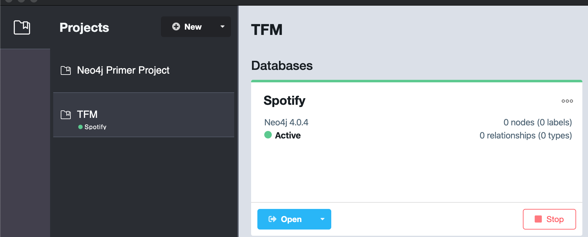

# 0. General

All the codes are assumed to be saved in the "Codigos" folder. Inside, there is a folder for each subtask (i.e Spotify) so, in each one you will find severals subfolders. The ones for developing code are **dev** and the final code is in **code**. 

<!--- 
Images:
 -->


## GitHub

All the repos will be in https://github.com/DavidAmat/. There will be a repo for each specific task in order not to mix dependencies for the dataset extraction, for the audio download and for the model construction.

To open a GitHub repo and link it to a local folder:

```bash
cd Codigos
mkdir Spotify
git init
git remote add origin https://github.com/DavidAmat/TFM_Spotify.git
git pull origin master
```
Each repo will have its own pipfile to avoid accumulate python packages for other tasks.

```bash

```


```bash

```
## Tables

Tables in Markdown are generated with https://www.tablesgenerator.com/markdown_tables

# 1. Spotify

The main code is in the folder **code/**.

The first thing to do is to create an **app** in Spotify API and get access in order to do Spotify API requests.

Once this is done, the main idea is to retrieve a list of artists from https://kworb.net/ with the idea to have all the top artists of Spotify and their songs as well as to create a graph for artists, songs (see which artists share songs) and similar artists and genres (edges from artist to artist and also from artist to genres). This dataset also provides the Spotify ID for either the artists and the songs, so it will be suitable for making future calls to the Spotify API to work always with such IDs. An artist who is NOT in Spotify cannot enter this study. To check an artist ID try: https://open.spotify.com/artist/<artist_id>

As regards architecture, we will first create a PostGRESQL and then convert this database named "Spotify" to a graph in Neo4j. This database will need info from songs too, we will either exploit the "kworb" dataset or, in case of artists which are not in that dataset and we want to include it, we will make a search in Spotify API for the top tracks of that artist.  

To start working on this section: 
```bash
cd Spotify
pipenv shell
pipenv run jupyter notebook
```

## 1.1 Description of the tasks 

So the order of steps to do is the following:

- Scrap the artists from the tables in the "kworb" website to create a list of artists which are present in kworb, we will denote these as "main_artists". 

- Use SpotifyAPI to find the Spotify ID for the artists that are not in the "main_artists" list, these artists will be denoted as "other_artists".

- Create a table **master_artist** to centralize all these results in PostGRESQL The "is_main" column will denote if either it has been found in the kworb website or not.

<center>

| table         | column      | type      | PK |
|---------------|-------------|-----------|----|
| master_artist | artist_id   | varchar() | Y  |
| master_artist | artist_name | varchar() | N  |
| master_artist | is_main     | bool      | N  |

</center>

This table should have as PK the artist_id to avoid inserting an artist_id that is already in the database. 

- After that we will query this table **master_artist** to retrive the is_main = 1, and scrap the "kworb" website, iterating for each artist and retrieving its top songs, as well as the featuring artists. This will be stored in another table, the **master_track** table:

<center>

| table        | column    | type      | PK |
|--------------|-----------|-----------|----|
| master_track | track_id   | varchar() | Y  |
| master_track | track_name | varchar() | N  |
| master_track | peak_date | date      | N  |
| master_track | streams | bigint      | N  |

</center>

For the songs that come from Spotify API (the songs for the "other_artists" instead of the peak date we have the "release date" which is more or less near in time so we will rely on that). 

- Finally, since one song can have many artists and one artist can have many songs, these relationships will be captured in the **rel_artist_track** table. It is important to state that if a featuring artist is NOT neither in the **master_artist** it will not appear in that table, and obviously, the same for a song that does not appear in the **master_track**. 

<center>

| table            | column    | type      | PK |
|------------------|-----------|-----------|----|
| rel_artist_track | track_id   | varchar() | N  |
| rel_artist_track | artist_id | varchar() | N  |

</center>

Recall that for the songs for the "other_artists" we will search the names of the songs, track_id and the featuring artists by means of the Spotify API. 

- After these information gets stored correctly, we will proceed to use the Spotify API again to retrieve **related artists**. This search, by setting as input an artist_id from the **master_artist** we will be able to get:
    - genres
    - followers
    - artist_name
    - artist_id

of the **similar artists** according to Spotify (popularity, followers and genres are referred to the similar artists, not the queried artist). Then, our task will be to check if any of these artists is present in the **master_artist** and if so, create a table to store those relationships:

<center>

| table             | column            | type      | PK |
|-------------------|-------------------|-----------|----|
| rel_artist_artist | query             | varchar() | N  |
| rel_artist_artist | rel_art           | varchar() | N  |
| rel_artist_artist | genre             | varchar() | N  |
| rel_artist_artist | popularity        | int       | N  |

</center>

This table will have double functionality, the maximum level of atomicity will be at the **genre** level, meaning that if artist A is similar to artist B and has 3 genres: 1,2,3, the table will look like:

<center>

| query | rel_art | genre | popularity |
|-----------------|-------------------|-------|------------|
| A               | B                 | 1     | 60         |
| A               | B                 | 2     | 60         |
| A               | B                 | 3     | 60         |

</center>

So to look at the genres that are more close to the query_artis_id = A we will do a SELECT DISTINCT of the column GENRE, whereas if we want to retrieve dual relationships between two artists, we will do a SELECT DISTINCT between the query and the similar artist_id columns. If we want to retrieve all the availables genres, we will only do a SELECT DISTINCT for the GENRE.

We will do a final table named **master_genre** to store univocally for each artist its gender or inferred gender (see Spotify code 05):

<center>

| table            | column    | type      | PK |
|------------------|-----------|-----------|----|
| master_genre | genre   | varchar() | N  |
| master_genre | artist_id | varchar() | N  |

</center>

- With these tables we are only left to create the graph, which will be explained in the next section.

### Credentials

- Username: david
- Password: pg
## 1.2 Data

All the data will come either from scrapping https://kworb.net/ and the Spotify API.


## 1.3 Code

### __00_Database_Creation__

We have connected to the PostGreSQL server, located in /Applications/Postgres.app/Contents/Versions/12/bin/psql. To execute it run:

```bash
psql -p5432 'spotify'

# To get list of tables
\dt

# Get info of table schema
\d <table_name>
```
This notebook contains the scripts to generate the tables from the Spotify database.  

It makes use of the code __db_utils.py__ which is a set of functions that will help to reduce writing code to the basic queries to the PostGreSQL server. 

(CONTINUE)


### __01_Master_Artist_Creation__

This script relies on the __aux_utils.py__ which has the credentials and functions to connect to Spotify API.

1. **GLOBAL ARTISTS**: The extraction from the https://kworb.net/spotify/artists.html of the list of artists is done by means of the **requests** package and information is fetched using **BeautifulSoup**. This is the list of artists that globally appear to be the most listened in Spotify. There are up to 10,000 artists.

2. **COUNTRY SPECIFIC ARTISTS**: A second round of artists retrieval is done by using a country-specific (from Spain) list of artists in the same website in https://kworb.net/spotify/country/es_weekly_totals.html. Most of artists will be present in the previous dataset but there are some that are not (artists which may be very specific from Spain and do not appear in the top artists globally). About 120 artists from the list of 3,615 top artists in Spain are not present in the global list. So we will add them to our list of "main_artists".

3. We identify some other groups both in Spain and in Catalonia that are worth including in the dataset, so they will be added in a different list from the main, since these are "other_artists". 

4. We will search for the artist_id and the tracks of the *other_artists* which were artists popular but not found in kworb dataset. We will do this by using the **spotipy** API functionality "search". Once we found the result, we will realize that it does not return artists but it returns tracks whose artist is similar to the queried one. In order to see which artists is the one that we have queried and to retrieve their artist_id, we will **go over the json returned** and inspect whether we find and artist that matches or is very similar to the queried one. To do so, we will use the **Levenshtein** distance between two strings (from __aux_utils.py__ function).

5. We will put them together and avoid any duplicate entries

6. Use the **executemany** command to allow uploading a list of tuples (the joined dataframe converted to tuples) into the **master_artist** table. Wit this, we will end the artist dataset creation and we are all set to go for the master_track and rel_artist_track in the following notebooks.


### __02_Master_Track_Creation__


This script relies on the __aux_utils.py__ which has the credentials and functions to connect to Spotify API.

The main goal of this script is to perform two tasks to create the **master_track** table:

- Go to kworb database and get the top 30 songs for each artists that we have as "is_main = 1"
- Go to Spotify API and search for the "Top Tracks" (built-in function in Spotipy) (retrieves 10 tracks) for that artist. 

1. Query the **master_artist** table to retrieve all the artists from the previous step. Make 2 dataframes, one for the "is_main = 1" artists and another one for the "other" artists.

2. Query the "kworb" database. Now the queries will be by artist, as they follow always the same structure "https://kworb.net/spotify/artist/<artist_id>.html". We will make one requests per artist, hence we will parse the returned html table. This table is a table of tracks, its peak date, the featuring artists ("With" column) and the number of streams (will be used as a measure of popularity for that song). This table will have then as columns: "Peak Date", "Track", "With", "Streams". Where Track is only the name of the track, in order to find the track_id, we need to parse the "href" for that text. 

3. Since we are looking at the html table, in order to assure that the track_id we retrieve analyzing the href of the table match the name of the track, we will create a dictionary mapping the "Track" (track_name) with the "track_id" (the ID that we will retrieve from the href). This dictionary will be used to create a new column named "track_id" with the track_id already computed in that dataframe for the songs of that artists. Then, we sort the dataframe descendingly by number of Streams and pick the **30 most popular songs for that artist**. 

4. For those songs that are "is_main = 0", we will query the "artist_id" in the Spotify API and retrieve all the results that Spotipy returns (10 most popular tracks per artist). Here, we don't have the Peak Date but we know the "release date" of the album, so we will use it as a proxy for the "Peak Date". Moreover, here we don't have info about the "Streams", hence, to denote that it is a song that is not retrieved from "kworb" but from the Spotify API, in the Streams column we will put a **-1**.

5. We insert each part in the **master_tracks**


### __03_Rel_Artist_Track_Creation__

This script relies on the __aux_utils.py__ which has the credentials and functions to connect to Spotify API.

The main goal of the script is to create the **rel_artist_track**, a table which will serve as a way to know which artist takes part in a song and viceversa, which songs have the same artist. 

1. Do a query in the **master_track** and **master_artist** table. Create a set of artists and a set of tracks (identifiers). This **set_artist** and **set_tracks** will be later used.

2. Do a request to the same URL as we did in the 02 code, that is, go to "https://kworb.net/spotify/artist/<artist_id>.html" and now, instead of only retrieving the track_id, we will retrieve all the **artists that are either the principal artist (<artist_id> of the URL) or any artist that appears in the "With" column of that table**, with the constraint that a given artist_id in the "With" column, must exist in the **master_artist** (be a member of **set_artists**), and the given **track_id** must be in the **set_tracks**, otherwise this track_id or artist_id won't be present in the master tables. 

3. We will impose that a featuring artist can be any artist we have in the **master_artists** (either is_main = 1 or not), but for the tracks, since the is_main = 1 artists' tracks were derived from the kworb database, and we are scrapping this web, it makes more sense to impose that the track_id must be one in the **master_track** where Streams > 0 (as Streams = -1 are for the tracks of the "other" artists tracks). 

4. We create a big dictionary with this schema:
    - Artist_id: opens a new dictionary with tracks as keys
        -Track_id: tracks are keys and each key has a list:
            - Feat artist list: is a list of the artist_id in the "With" column of the table. Before accepting any artist, we will check in the **set_artists** (both the "main" and "other" artists whether this artist_id exists in our database or not, if does not exist, we will NOT include them). 
            - This is the most time-consuming part, taking more than 1 hour to complete the webscrapping of all the artists top 30 tracks.

5. Convert the dictionary into pairs artist-track to feed the table **rel_artist_track**. 

6. For the **other** artists, since they are not present in the "kworb" dataset, we will query the top 10 tracks via Spotify. Using the Spotipy function "artist_top_tracks" we retrieve the **track_id**.

7. We upload all these pairs to the **rel_artist_track** also. 

### __04_Rel_Artist_Artist_Creation__

In this code we will try to extrack as many information as possible for each artist, retrieving the list of similar artists 100% via Spotipy.

The idea is to feed the table **rel_artist_artist**. We will query one artist and we will retrieve similar artists.

1. Get all the artists in our database (master_artist).

2. Create a set of artists (to search if the related artist is in our database).

3. For each artists, query the Spotipy function "artist_related_artists" and retrieve, for each artist_id similar to the queried one:
    - Popularity
    - A list of genres: loop through all the genres and append to a list all theses properties (popularity, artist_id, genre) for every genre in that list. Recall that the table "rel_artist_artist" has as many rows as genres per artist-artist pair. At each append we make sure that the artist_id of the similar artist **must be in the master_artist table**. We also correct the genre name to avoid characters like " ' " (single quote).

### __05_Rel_Genre_Artist_Creation__

Since the information of gender is provided in the table **rel_artist_artist** and its attributed to the "rel_artist" and not to the queried artist, we suspect that there will be some artists in the "master_artist" that will not have an associated genre. If this is the case we will **infer** the genre of the query artist (that has not been found in the rel_art column and appears in the master_artist), by looking at its rel_art and do a majority voting of the most popular genre among its related artists. If no genre is found, there will be a **undefined** genre for those cases. In case of tie, we will pick randomly the genre among the tied ones.  

The main idea is to create a table **master_genre** to store this information:

<center>

| table            | column    | type      | PK |
|------------------|-----------|-----------|----|
| master_genre | genre   | varchar() | N  |
| master_genre | artist_id | varchar() | N  |

</center>


## 1.4 Problems

- We are running intro problems in Mac with the import of psycopg2. We search for the error: https://stackoverflow.com/questions/57236722/what-does-import-error-symbol-not-found-pqencryptpasswordconn-mean-and-how-do and install two versions lower. FUNCIONA

# 2. Neo4j

## 2.1 Creating a Graph Model

Create a graph model with the password: qrks

- Path import folder: cd /Users/david/Library/Application\ Support/Neo4j\ Desktop/Application/neo4jDatabases/database-f313678c-0e5d-4cf0-bbec-5ee510a4fd59/installation-4.0.4/import
(alias shortcut: neo_import)

- Use the Neo4j Desktop app to create it.

## 2.2 06_Downloading_PostgreSQL_csv

The datasets downloaded from PostgreSQL will be stored in Codigos/Spotify/data/psql_out.
Such downloads are managend through this notebook (title)

### a) Master Track

- Remove the ";" of the track_names

### b) Master Artist

- Since we want our Artists to have a popularity score and not all artists have such score (which comes from the **rel_artist_artist**) we will do the following:

    - Select rel_art, popularity from that table as a DISTINCT table to link each artist with each popularity
    - For those artists in the Master Artists that don't have popularity associated, we will look at all of its rel_art and do the mean of the popularity to assign that popularity to the artist.
    - The resulting dataframe will be the one that will be downloaded as .CSV to feed the Neo4j graph


### c) Master Genre

Select all the genres (distinct) in the master_genre. 

### d) Relationships

We create the relationships querying the corresponding table:

- GEN_ART: genre -> artist_id from master_genre
- ART_TR: artist_id -> track_id from rel_artist_track
- REL_ART: artist_id1 -> artist_id2 from rel_artist_artist (query, rel_art)

All these csv files are stored in **/Users/david/Google Drive/16. Master BigData/5 - Modulos/Modulo 10 - TFM/2. TFM/Codigos/Spotify/data/psql_out**.

**We have to move manually those .csv files to the IMPORT folder for the Database instance created:** 

```bash
/Users/david/Library/Application Support/Neo4j Desktop/Application/neo4jDatabases/database-ada73e8c-396c-4507-82cc-758b5f072ea4/installation-4.0.4/import
```

## 2.3 07_Cypher_Database_Graph_Creation

Once we have added a Database named Spotify to our Project TFM we need  to write the Cypher queries that will read the .csv files in the "import" folder and upload them as nodes and relationships.




### a) Define Database Schema

#### Nodes
- t:Track
    - track_id
    - track_name
    - peak_date
    - streams
- a:Artist
    - artist_id
    - popularity
    - artist_name
    - is_main
    
- g:Genre
    - genre_id

#### Relationships

- GEN_ART: artist - genre
- ART_TR: artist - track
- REL_ART: artist - artist

### b) Add the constraints

- Since we don't want any node to be duplicated in terms of artist_id, track_id or genre, we will add beforehand the constraints regarding such nodes (which do not exist yet):

```cypher
CREATE CONSTRAINT ON (t:Track) ASSERT t.track_id IS UNIQUE 
CREATE CONSTRAINT ON (a:Artist) ASSERT a.artist_id IS UNIQUE 
CREATE CONSTRAINT ON (g:Genre) ASSERT g.genre_id IS UNIQUE 
```
This is done because when doing a MERGE, Cypher has to check if that node already exists, so INDEXING its property of ID (track_id, artist_id, genre_id) will ease that task and reduce LOAD time.

### c) Artists

Upload the artist nodes taking into account that "popularity" is an integer and "is_main" should be a boolean, not a "True" / "False" string!

```cypher
LOAD CSV WITH HEADERS FROM "file:///master_artist.csv" AS line FIELDTERMINATOR ';'
MERGE (a:Artist {  
                    artist_id: line.artist_id,
                    artist_name: line.artist_name,
                    popularity: toInteger(line.popularity),
                    is_main: (case line.is_main when 'True' then true else false end)
                     })
```

### d) Tracks

Here we have to remember to convert the peak_date string to a date and streams to integer:

```cypher
LOAD CSV WITH HEADERS FROM "file:///master_track.csv" AS line FIELDTERMINATOR ';'
MERGE (t:Track {  
                    track_id: line.track_id,
                    track_name: line.track_name,
                    streams: toInteger(line.streams),
                    peak_date: date(line.peak_date)
                     })
```


### d) Genre

Finally, we add the genre names as genre_id, since those are simply strings and a ID will not help in easing the identification of genres, which are only 1,000 strings more or less.

### e) Create index on names

After all nodes have been added with its properties, now we can set an index for the artists and track names to ease querying by a certain name.

```cypher
CREATE INDEX ArtistName FOR (a:Artist) ON (a.artist_name) 
CREATE INDEX TrackName FOR (t:Track) ON (t.track_name) 
```

### f) Add the relationships

Here we add the 3 relationships that we have presented before:

```cypher
LOAD CSV WITH HEADERS FROM "file:///rel_GEN_ART.csv" AS line FIELDTERMINATOR ';' 
    MATCH (g:Genre {genre_id: line.genre})
    MATCH (a:Artist {artist_id: line.artist_id})
    MERGE (g)-[:GEN_ART]->(a)
```

```cypher
LOAD CSV WITH HEADERS FROM "file:///rel_ART_TR.csv" AS line FIELDTERMINATOR ';' 
    MATCH (a:Artist {artist_id: line.artist_id})
    MATCH (t:Track {track_id: line.track_id})
    MERGE (a)-[:ART_TR]->(t)
```

```cypher
LOAD CSV WITH HEADERS FROM "file:///rel_REL_ART.csv" AS line FIELDTERMINATOR ';' 
    MATCH (a1:Artist {artist_id: line.artist_id1})
    MATCH (a2:Artist {artist_id: line.artist_id2})
    MERGE (a1)-[:REL_ART]->(a2)
```

### g) BackUp

We finally do a BackUp to store in the "import" folder a .bk copy of the actual database.


## 2.4 08_Graph_Analysis

Contains the most used queries to validate that everything has been added properly.

Example:
```cypher
// Most Streamed songs, getting artist and genre
MATCH (a:Artist)-[:ART_TR]->(t:Track)
WITH a, t
ORDER BY t.streams DESC
LIMIT 20
MATCH (g:Genre)-[:GEN_ART]->(a:Artist)
RETURN a, g, t                  
```


## 2.5 09_Neo4j_Python_Connection

We install "py2neo" to query the Spotify Database with a python driver.
We can retrieve the results in a dataframe.


## 2.6 10_Create_List_Song_Artist_Query_Youtube

Now is a crucial step, we need to decide if we are going to download all songs or just a few. The idea is that if we manage to download all audios, we will be able to select as many songs as we want for each artist when training the neural network, otherwise, if we need more data we will be stucked and need to re-run again this code to generate a much wider list of artist-track.

Data is exported to /Spotify/data/01_queries_yt where there is a .csv named queries.csv that will be the file that will take the queue for sending jobs to each instance.

# 3. AWS Youtube Scrap

## 3.1 PuTTY

Using XQuartz, launch a terminal and put tfm, navigate to the folder where the .pem exist and convert it to .ppk:

```bash
sudo puttygen TFM_London.pem -o TFM_London.ppk -O private
```

## 3.2 AWS Parallel Cluster

1. Create a new user:

- User: tfm

- Enable Programmatic access

- Credentials:
    Look in Codigos/credentials/user_tfm

2. Install both parallel cluster and awscli python packages in the Codigos/AWS folder (which is linked with a different pipenv). 

3. Parallel Cluster configuration is written in /Users/david/.parallelcluster/config

4. Now we are going to test which configuration does the instance needs to initialize with selenium downloaded.

### 3.2.1 Install Selenium on a t2.small

- Named: test_selenium
- SSH into it (assuming we are on the /Codigos/AWS directory)

```bash
# First protect the .pem file (only the first time)
chmod 400 TFM_London.pem

# Run the command
tfm
cd AWS/
ssh -i "../credentials/AWS_KeyPair_London/TFM_London.pem" ec2-user@ec2-35-179-75-206.eu-west-2.compute.amazonaws.com
```

Inside the **test_selenium** instance do:

```bash
sudo su
sudo yum update -y

# Install python 3.7 and pipenv
sudo yum install python37

# Get pip
curl -O https://bootstrap.pypa.io/get-pip.py

#Run it
python3 get-pip.py --user

#Install pipenv
sudo pip3 install pipenv

#Add pipenv to path
export PATH=/usr/local/bin:$PATH

# But is better to modify the ~/.bashrc file and add this
# this will enable localization of the pipenv in the PATH variable
export PATH=/usr/local/bin:$PATH

# mkdir scrap
mkdir scrap

# This time we will not download the pipfile from the github repo
# what we will do is to download the package by our own
pipenv shell

touch requirements.txt
nano requirements.txt

# Copy and paste this list
pipenv install pandas==1.0.5
pipenv install numpy==1.19.0
pipenv install tqdm==4.46.1
pipenv install boto3==1.14.12
pipenv install v_log==1.0.1
pipenv install awscli
pipenv install jupyter
pipenv install requests
pipenv install beautifulsoup4
pipenv install lxml
# Configure the AWS credentials for the London region
aws configure

# Change the Security Group Inbound rule for TCP in port range 8888
# since we will need to acces through Jupyter

# Go to the sg and create a Custom TCP for port 8888 for source 0.0.0.0/0

# Generate the config to allow running jupyter notebook and accessing through another IP
pipenv run jupyter notebook --generate-config

# Configuration is written in /root/.jupyter/jupyter_notebook_config.py
# Edit it
vi /root/.jupyter/jupyter_notebook_config.py
/c.NotebookApp.ip
i
c.NotebookApp.ip = '*'
:wq!

# Save and quit. Now run finnaly:
pipenv run jupyter notebook --no-browser --allow-root

# Copy the http and change the DNS for the IP (in our local browser)
http://ip-172-31-5-84.eu-west-2.compute.internal:8888/?token=e63b5cb4248372d1f8fd35c88bdddfbb4741ca279a75b740

# Change it to
http://35.179.75.206:8888/?token=e63b5cb4248372d1f8fd35c88bdddfbb4741ca279a75b740

# INSTALL SELENIUM

## Install chromedriver
sudo su
yum -y install libX11 
cd /tmp/
sudo wget https://chromedriver.storage.googleapis.com/83.0.4103.39/chromedriver_linux64.zip
sudo unzip chromedriver_linux64.zip
sudo mv chromedriver /usr/bin/chromedriver
chromedriver --version
# IMPORTANT! make SURE that the chromedriver version matchs the google-chrome --version below

## Install binary Google Chrome
sudo curl https://intoli.com/install-google-chrome.sh | bash
sudo mv /usr/bin/google-chrome-stable /usr/bin/google-chrome 
google-chrome --version && which google-chrome
#IMPORTANT! make SURTE this version of google chrome matches the chromedriver

## Install Selenium
#su ec2-user #change user and go to the scrap/ folder and run
pipenv shell
pipenv install selenium
```

We can try a Python Script to check that it works:

```python
from selenium import webdriver
from selenium.webdriver.common.by import By
from selenium.webdriver.support.ui import WebDriverWait
from selenium.webdriver.support import expected_conditions as EC
from selenium.common.exceptions import TimeoutException
from selenium.webdriver.chrome.options import Options

#Selenium options
options = Options()
options.add_argument("--headless")
options.add_argument("window-size=1400,1500")
options.add_argument("--disable-gpu")
options.add_argument("--no-sandbox")
options.add_argument("start-maximized")
options.add_argument("enable-automation")
options.add_argument("--disable-infobars")
options.add_argument("--disable-dev-shm-usage")

url = 'https://github.com/'

driver = webdriver.Chrome(options=options)

# Navigate to github.com
driver.get(url)

# Extract the top heading from github.com
text = driver.find_element_by_class_name('h000-mktg').text

print(text)
```

### 3.2.2 FileZilla to transfer the queries.csv

We need inside this instance the file in which we have all the artists and tracks to search for. Hence, we will connect to the EC2 instance with FileZilla:

- First add the key file as they say in here:

https://stackoverflow.com/questions/16744863/connect-to-amazon-ec2-file-directory-using-filezilla-and-sftp

- What it is not explained is that you have to go to the File > Site Manager Add and choose:
    - Protocolo: SFTP - SSH File Transfer Protocol
    - Servidor: <paste_here_the_DNS_of_the_instance>
    - Puerto: leave as empty
    - Modo de acceso: Archivo de claves
    - Usuario: ec2-user
    - Archivo de claves: select the .pem file

- Drag and drop the queries.csv file in the /Spotify/data/01_queries_yt (created in the 2.6 Section: 10_Create_List_Song_Artist_Query_Youtube)

- We will create a directory named "/data" inside the "scrap" folder in the EC2 instance. Since the folder is created with the "root" user, we will not be able to drag and drop to data/. Hence, we drag and drop to the ec2-user folder and then in the terminal, as root, we will move the queries.csv to the data/ folder.

### 3.2.3 Create a Bucket in S3

- Create a bucket named: tfmdavid
- Location: EU-WEST-2 (London)

- We will create a folder named urls/ to store all the artists song's urls in youtube to be downloaded.

### 3.2.4 Check Selenium in the EC2 instance

```bash
ssh -i "../credentials/AWS_KeyPair_London/TFM_London.pem" ec2-user@ec2-35-179-15-53.eu-west-2.compute.amazonaws.com

sudo su
cd scrap
pipenv shell
pipenv run jupyter notebook --no-browser --allow-root
```

In the test/ folder we run the test_youtube.ipynb as a first attempt to handle this scrapping.

< EXPLAIN the CODE in the EC2 instance>

### 3.2.5 Create PostGreSQL as RDS service

1. We will follow the tutorial in: https://aws.amazon.com/getting-started/tutorials/create-connect-postgresql-db/

dbname: postgres
User: david
Password: qrksjfutivuf1

**VERY IMPORTANT!!**: since we are going to make inbound queries (INSERT INTO) this database, we will modify the security group to allow INBOUND traffic for any source (0.0.0.0/0) at port 5432.

2. Use Pg_Admin to access to the DB server that is launched in the RDS section. See the ENDPOINT. 
- Add a Server
- Host: ENDPOINT address
- Port: 5432

3. Install in the EC2 instance the following to enable the installation of psycopg2:

```bash
sudo yum groupinstall "Development Tools"
yum install postgresql-devel
sudo yum install python3-devel
sudo yum install postgresql-libs
pipenv install psycopg2
```

It is possible that it does not allow the installation of psycopg2 due to the gcc requirement... If so, try to stop the instance and reboot it again. After that what I have also tried is to connect to the ENDPOINT through:

```bash
psql -h tracksurl.czjs6btlvfgd.eu-west-2.rds.amazonaws.com -p 5432 - U david
```
To get the whole history of commands done, go to AWS/hist/postgresql_install/hist_postgresql_install.txt

4. Go to Jupyter Notebook and import psycopg2 correctly to check the installation and from now on you can query the RDS service by:

```python
ENDPOINT="tracksurl.czjs6btlvfgd.eu-west-2.rds.amazonaws.com"
PORT="5432"
USR="david"
REGION="eu-west-2"
DBNAME="postgres"
PSSWD=["qrks","jfut","iv","uf","1"]
try:
    conn = psycopg2.connect(host=ENDPOINT, port=PORT, database=DBNAME, user=USR, password=''.join(PSSWD))
    cur = conn.cursor()
    cur.execute("""SELECT * from results""")
    query_results = cur.fetchall()
    print(query_results)
except Exception as e:
    print("Database connection failed due to {}".format(e))            
                
```

### 3.2.6 Install Parallel Cluster on AWS virtualenv

We follow: https://docs.aws.amazon.com/parallelcluster/latest/ug/install-virtualenv.html
Go to the folder Codigos/AWS and do pipenv shell.
Install boto3, awscli and aws-parallelcluster.
Verify installation:

```bash
pcluster version
```

- Create an image of the instance (t2.small) where the Selenium and WebScrapping in youtube has been done. There has been a "silly.py" file done in scrap/tests to test the ParallelCluster.  To create the AMI, we go to the AWS Console. We will name it "scrap_image"

- We copy its AMI ID: ami-0c09047f8c93915e6

- We follow instructions of: https://docs.aws.amazon.com/parallelcluster/latest/ug/getting-started-configuring-parallelcluster.html

```bash
pcluster configure
```

- Modify the script /Users/david/.parallelcluster/config:
```bash
code /Users/david/.parallelcluster/config

# Create a session for the cluster named: scrap
[aws]
aws_region_name = eu-west-2

[global]
cluster_template = default
update_check = true
sanity_check = true

[aliases]
ssh = ssh {CFN_USER}@{MASTER_IP} {ARGS}

[cluster default]
key_name = TFM_London
base_os = alinux2
scheduler = torque
custom_ami = ami-0d323793ce47854a1
master_instance_type = t2.small
compute_instance_type = t2.small
min_vcpus = 1
max_vcpus = 100
vpc_settings = default
desired_vcpus = 1

[vpc default]
vpc_id = vpc-008fe5e559a705470
master_subnet_id = subnet-048d13c6988e9a6ff
compute_subnet_id = subnet-06725b453d0fd761d
```
IMPORTANT! we see that by setting a t2.small instance type there is an error saying that compute_instance_type 't2.small' is not supported by awsbatch in region 'eu-west-2'. We tried to do so in eu-west-1 resulting in the same problem. Finally, we decide to create a c5.large instance, it creates the cluster but when ssh into the compute instance from the master instance, we see that it has not INHERITED the custom AMI. We then try to launch manually an EC2 instance of c5.large type from that AMI and realize that no options is given for this type of instance, so we search for a instance type that it allows us BOTH to create the instance from that AMI and to create the cluster using pcluster create. This is the case for "m5.large". This step does not work neither. When we ssh into it we see that no folder scrap/ is present and the AMI ID where the compute node was launched is not the AMI that we have set (although the AMI ID for the MASTER node is indeed the AMI ID of our custom AMI). We proceed to set the same subnet to the awsbatch cluster for the master node and the compute nodes. It fails in the launch process. Finally, we try to change the shceduler from awsbatch to torque.

- Run the creation of the cluster:
```bash
pcluster create ClusterScrapping

#Result
Beginning cluster creation for cluster: ClusterScrapping
WARNING: The configuration parameter 'scheduler' generated the following warnings:
The job scheduler you are using (torque) is scheduled to be deprecated in future releases of ParallelCluster. More information is available here: https://github.com/aws/aws-parallelcluster/wiki/Deprecation-of-SGE-and-Torque-in-ParallelCluster
Creating stack named: parallelcluster-ClusterScrapping
Status: parallelcluster-ClusterScrapping - CREATE_COMPLETE
MasterPublicIP: 35.176.37.132
ClusterUser: ec2-user
MasterPrivateIP: 10.0.0.239
```

- Now we follow the tutorial https://docs.aws.amazon.com/parallelcluster/latest/ug/tutorials_03_batch_mpi.html:

```bash
pcluster ssh scrap -i "../credentials/AWS_KeyPair_London/TFM_London.pem"

# Create a job file: nano job1.sh
# ------ BOF
#!/bin/bash
cd /home/ec2-user/scrap/test
./silly.py 5 prova5
# ------ EOF
# Launch the job 
awsbsub -jn test5 -cf job1.sh
watch --interval=0.5 qstat
```

#### 3.2.7 Workaround trobleshooting

Since the time of creation of each compute node is quite huge due to all the installations that may happen for this node to run un the ParallelCluster we will opt for choosing an already existing AWS ParallelCluster AMI.

We will follow https://docs.aws.amazon.com/parallelcluster/latest/ug/aws-parallelcluster-ug.pdf and try to launch this instance from the IMAGE of the eu-west-2 region and try to install everything (seleniums and company...) that the instance needs. After that, we will create a image of that modified instance but this AMI will be now a ParallelCluster AMI so the launch times will be shortened.

1. Go to: https://github.com/aws/aws-parallelcluster/blob/v2.7.0/amis.txt and select the one from alinux2 eu-west-2: ami-018bfff85c6d9a8b1

2. Launch instance in Community AIs (filter by ami-018bfff85c6d9a8b1)

3. Commands

```bash
sudo su
sudo yum update

# Install python, pipenv, requirements...


# Install selenium
# FOLLOW Instructions in step 3.2.1
```

4. Then we have to realize how to run commandas as sudo su, being ec2-user:

```bash
#!/usr/bin/env bash
sudo -i -u root bash << EOF
/root/.local/share/virtualenvs/scrap-9ZJEulFg/bin/python /home/ec2-user/scrap/code/main_scrap.py 0 100
EOF
```

What this will do is run the scrapping for the rows 0, 1, 2..., 100 from the dataframe queries.csv.

We will follow this strategy (called heredoc) to run the script of the .py that we create for the extraction of youtube addresses and feed the result in the PostgreSQL database that we have setup, querying the table "results".

## 3.3 How to run jobs in the cluster?

1. Trhee scripts are needed:
    - create_job.py: creates the list of files job_X.sh (where X is the job number, which is the batch that we will submit to a compute instance). It creates a folder jobs/ where it stores all the jobs bash scripts.

    - qsub_jobs.sh: are the jobs that are executed as qsub, where qsub executes inside a for loop in bash all the job_X.sh created by create_job.py. When executed, it must be executed as ec2-user! 

    - main_scrap.py: it has the code that does the web scrapping. It takes as arguments two values: initial_row and final_row. These "rows" refer to the "queries.csv" dataframe, which is loaded at the start of the script to get all the list of artists and songs that will be scrapped. With the initial and final rows what we do is to slice the dataframe to only get the rows between initial and final row (both edges are included). So each execution of this function will do several songs scrapping, inside a for loop, independently ones from the others, so they are scrapped sequentially in the for loop.  **To run this script, it is assumed that you should be the ROOT user as well as execute it with the python interpreter from the pipenv!!!**. This means that instead of submitting a job that calls: python main_scrap.py, we will submit a job with the path to the python interpreter (with selenium installed and the psycopg2 library to connect to the DB instance). The path for the python interpret should be something like `/root/.local/share/virtualenvs/scrap-9ZJEulFg/bin/python`. We are always working with global paths to avoid having to change directories each time. Hence, to run this script we will reference to its path inside the compute node: /home/ec2-user/scrap/code/main_scrap.py

2. Once we have such scripts ready we need to recap a little bit all the steps taken so far:

    - We have first generate a table (queries.csv) of all songs and artists to scrap.

    - We have launched a t2.small instance to test selenium (t2.small) and develop our main_scrap.py code. This instance **was launched using a AWS ParallelCluster AMI** (read manual  https://docs.aws.amazon.com/parallelcluster/latest/ug/aws-parallelcluster-ug.pdf on page 104). We have the list of AMIs that should be selected for each region, so we choose the AMI for "alinux2" and eu-west-2: ami-018bfff85c6d9a8b1. Remember, this is just the AMI id of the instance we are going to modify. On top of that instance we have to follow all the instructions given on "3.2.1" section to set up correctly this instance to support both PSQL and SELENIUM installing the chromedriver, etc... 

    - Once this instance is up and running, we test the python script with some samples to see that it works well and does the insert to the PostgreSQL in the Table "results". If it succeeds we proceed.

    - Create an AMI for that instance. This will be the "base_scrap" AMI, recall the AMI "ami-0d323793ce47854a1" we have set in the "custom_ami" property in the ParallelCluster configuration file, this is the AMI that we want to act both as Master and Compute nodes, the instance that we now is up and running to execute selenium and postgresql and that it was initially a ParallelCluster AMI.

    - Once it is created, we launch the creation of the cluster: ClusterScrapping.

    - Once it is created, we SSH into the Master node. Realize that the Master node is inside a Public Subnet, but you will see how the compute nodes are inside a Private Subnet, hence, they do not have a IP associated. They can only be accessed in this setting through the Master Node.

    - We go to the scrap/code folder and run the pipenv shell in order to activate the python environment (in theory not necessary if we are calling the full path of the python executable `/root/.local/share/virtualenvs/scrap-9ZJEulFg/bin/python`). Run:

    ```bash
    # Modify first create_job.py
    nano create_job.py

    # We have to add the number of rows per batch that we want
    # as well as the size of the total table "queries.csv"

    # After that, execute the script:
     /root/.local/share/virtualenvs/scrap-9ZJEulFg/bin/python  create_job.py
    ```

    - You will see a folder named "jobs/" created with plenty of "job_X.sh". If we inspect one of these files:

    ```bash
    #!/usr/bin/env bash
    sudo -i -u root bash << EOF
    /root/.local/share/virtualenvs/scrap-9ZJEulFg/bin/python /home/ec2-user/scrap/code/main_scrap.py 200 299
    echo 'Fin'
    EOF
    ```
    We see the heredoc technique to run as root the python interpreter and the main_scrap.py. Recall that this script must be executed as ROOT, but when the Compute instance receives the job and executes this bash script, since it has just started the node as "ec2-user" we have to make something to execute that python script as ROOT. This script will tell that instance to read the "queries.csv" table and scrap all songs from rows 200 to 299 included. 

    - After such files are generated, we then proceed to execute their **submission** to the cluster. In this case since we have 83957 rows and 100 rows are done per job (this is what we know as batch), there will be 840 jobs (job_0.sh, job_1.sh, ..., job_839.sh). We must remember the highest number X of the job_X for the next step.

    - We will create the qsub_jobs.sh script, which is a full bash script that does a loop from 0 to X (839) and run at each time of the loop the qsub command on that job inside the jobs folder:
    ```bash
    for i in {0..839}
    do
        qsub jobs/job_$i.sh
    done
    ```

    - This will run submitting all jobs in the cluster. First Compute instances are the ones that last more in order to launch, since they have to launch a new instance from the custom AMI provided... 

    - We can monitor all the jobs by executting qstat:

    ```bash
    qstat -r # to list only running jobs
    pbsnodes # to see which are the running nodes

    # For example for one of the instances
    ip-10-0-44-146
     state = job-exclusive
     power_state = Running
     np = 1
     ntype = cluster
     jobs = 0/145.ip-10-0-0-239.eu-west-2.compute.internal
     status = opsys=linux,uname=Linux ip-10-0-44-146 4.14.181-140.257.amzn2.x86_64 #1 SMP Wed May 27 02:17:36 UTC 2020 x86_64,sessions=5044 15230,nsessions=2,nusers=2,idletime=6803,totmem=2039140kb,availmem=1213468kb,physmem=2039140kb,ncpus=1,loadave=2.40,gres=,netload=525966268,state=free,varattr= ,cpuclock=Fixed,macaddr=06:f4:77:19:0b:ce,version=6.1.2,rectime=1593637607,jobs=145.ip-10-0-0-239.eu-west-2.compute.internal
     mom_service_port = 15002
     mom_manager_port = 15003
    ```


    ### 3.2.7 Export PostgreSQL to track_url table in the local PostgreSQL

    - We go to TFM > BBDD and we will make an extraction of the table in AWS RDS in order to disconnect that database and work with a local copy of it.

    ```bash
    pg_dump --host tracksurl.czjs6btlvfgd.eu-west-2.rds.amazonaws.com --port 5432 --username david --file "track_url.sql" --table public.results postgres
    ```

    - It will ask the password we have set: XXqrksssjfuaativuf13333

    - Go to the local database and import it:
    ```bash
    psql spotify < track_url.sql
    ```

    - Modify the name of the table "results" to be "track_url" (in PgAdmin4)


    ### 3.2.8 Add URL property to the graph

    - Now we will add to the Track nodes in the Neo4j the property "url" and "yt_views" (visualizations of youtube video). This property will have one issue, it may happen that for the same song, if queried from different artists, a different href is being set because of the Youtube query and the order of the videos rendered as results from the queried (i.e La Bicicleta Shakira vs. La Bicicleta Carlos Vives may not lead the same video on top of results). For this reason, we will set this property as unique and only updatable if it does not exist, in this way we will update the URL on the first time it sees that song node but once set, this URL property will be immutable.

    1. First go to the **06_Downloading_PostgreSQL_CSV.ipynb** script which was created on the first part of the project to download as .csv all the tables in the local PostgreSQL and we will add one download cell for the table **track_url** in which we will only extract the track_id, href and visual columns. Execute the query, convert it to .csv, and save it to the folder "import" of neo4j:
    
    ```bash
    /Users/david/Library/Application Support/Neo4j Desktop/Application/neo4jDatabases/database-ada73e8c-396c-4507-82cc-758b5f072ea4/installation-4.0.4/import
    ```

    2. Go to **07_Cypher_Database_Graph_Creation.ipynb** and add a section to upload a property (SET) in case the Track.url property and Track.yt_views property does not exist, create it from the "tr_url.csv" file we have just moved to the "import" folder of neo4j.

# 4. Youtube Download and Analysis

This task consists of taking a set of track_id and download their audios in youtube.
We will do so using the youtube_dl library and taking in as inputs the track_id and yt_url for each song we want to download.
The order to download each song will be given through a AWS SQS queue, which will allow us the capacity of, in case we get banned in one region from downloading too many audios
The idea is that it will upload the results to "tfmdavid/audio" bucket (the result is a .mp3 ) and create a spectogram for the full song. This spectogram can be later windowed to extract pieces of the song for the same length of time. 

So, step by step, we will first launch a new EC2 instance, which will allow us to perform both the YOUTUBE download. The idea will be that once downloading an audio and uploading to S3, we will **trigger a Lambda function** that will run an audio analysis to convert the audio to spectogram (https://medium.com/@manivannan_data/import-custom-python-packages-on-aws-lambda-function-5fbac36b40f8).

## 4.1 Configure Instance for Audio Downloading

- Launch a t2.small instance and perform the following to install everything we need:

```bash

# PYTHON and PIPENV
sudo su
sudo yum install python37
curl -O https://bootstrap.pypa.io/get-pip.py
python3 get-pip.py --user
sudo pip3 install pipenv
add to ~/.bashrc file: sudo nano ~/.bashrc >> export PATH=/usr/local/bin:$PATH
source ~/.bashrc
# add it to the other user too (ec2-user and root) (both bashrc files in both users)

# Directory: audio
mkdir audio
chmod 777 audio
cd audio/

# Install basics (as root)
sudo su
pipenv shell
pipenv install pandas==1.0.5
pipenv install numpy==1.19.0
pipenv install tqdm==4.46.1
pipenv install boto3==1.14.12
pipenv install v_log==1.0.1
pipenv install awscli
pipenv install jupyter
pipenv install pexpect
echo 'Fin'

# Allow running jupyter notebook (sudo su)
> First modify the Security Group to allow TCP on port 8888 as inbound traffic

pipenv run jupyter notebook --generate-config
vi /root/.jupyter/jupyter_notebook_config.py
	- use the / function of vi to search for: c.NotebookApp.ip = '*'
	- UNCOMMENT THE LINE!!! (erase the #)
	- use function "i" to (INSERT) modify the c.NotebookApp.ip from 'localhost' to '*'
	- ESC to write the write&exit: :wq!
pipenv run jupyter notebook --no-browser --allow-root

# When launching this new instance again do:

sudo su
cd audio/
pipenv shell
pipenv run jupyter notebook --no-browser --allow-root

# Save and copty to the local browser
http://ip-172-31-3-245.eu-west-2.compute.internal:8889/?token=e209a9fd7f8bb7a2b5796f735591889757bea8ef982be5c9

# Replace the DNS by
3.8.95.164

# Leading to
http://3.8.95.164:8889/?token=e209a9fd7f8bb7a2b5796f735591889757bea8ef982be5c9

# AWS CREDENTIALS
aws configure
AWS Access Key ID [None]: AKIAYXXXXXX
AWS Secret Access Key [None]: W6e2rYMXXXXXX
Default region name [None]: eu-west-2
Default output format [None]: json

## INSTALL FFMPEG
cd /usr/local/bin
mkdir ffmpeg
cd ffmpeg
wget https://johnvansickle.com/ffmpeg/releases/ffmpeg-release-amd64-static.tar.xz
tar xvf  ffmpeg-release-amd64-static.tar.xz
mv ffmpeg-4.3-amd64-static/ffmpeg . # this may change, check ls which si the folder download because maybe version 4.4 is available and downloaded
ln -sfn /usr/local/bin/ffmpeg/ffmpeg /usr/bin/ffmpeg

# INSTALL YOUTUBE DL - 
pipenv install ffprobe
pipenv install youtube_dl
```

Now the instance is up and running. We will create a script **main_download.py** which will read from a queue if it finds the "yt_url" and "track_id" and it will download it, and upload to S3 as well as inform to the "status" queue that if has been downloaded correctly. We will insert a functionality to **stop consuming SQS messages and end the execution if IT FAILS to DOWNLOAD more than 2 SONGS in a row** meaning that the instance IP has been banned from downloading more songs. The solution will then be to provision those EC2 instances in another region but we will get on that later.

## 4.2 Creating Queues and Master Download

The process of selecting which songs are going to be downloaded will be guided through the notebook in **Spotify/code** named **11_Download_Songs_Queues.ipynb**:

1. Create a SQS queue (in London) **jobs_download** (Standard) and **status** (Standard) and send all the pairs "yt_url, track_id" that we want to download to the "jobs_download". The "status" will monitor which instance did which track, at which date, and if that track was correctly processed or not. In principle, if a job fails, it will be resend to the **jobs_download** queue, but, if the problem is that the video cannot be found, then this song will not be downloaded because of the limitations of "youtube-dl" software. The reason why both queues are standard is because we don't care in which order they are processed as long as they are done. Also, when doing a FIFO, if the visibility timeout is 10 seconds, when the 1st message is being read, you cannot get the 2nd message if the 1st has not been deleted. If you don't delete it, the message will appear again so, when parallelizing a download queue system like the one we want, FIFO will not work when multiple instances access at the same time the same queue and need to receive **different messages**

    - **Jobs_download**:

        - When creating the "jobs_download" queue we have to take into account the Visibility Timeout (https://docs.aws.amazon.com/AWSSimpleQueueService/latest/SQSDeveloperGuide/sqs-visibility-timeout.html). For security purposes we will set this time to 2 minutes, meaning that if in 2 minutes this message has not been deleted, it means that it has not been processed correctly, hence, it will be resend automatically to the queue (visibility timeout = 2 minutes). 

        - The retention period will be 14 days (after 14 days, that message gets eliminated from the queue).

    - **Status**:
        - Retention of 14 days

    - We will store the URL for those queues!


2. Launch an EC2 or more instances that will be launched using the image **base_download**, which is an AMI of the instance that we have just configured in 4.1. This  instance will have the **main_download.py** that will be based on a While loop that will run infintely until 2 things occur:
    - 1) No more messages are in the queue
    - 2) We get **banned**: when running the download of such videos, especially the mainstreams one, youtube-dl always find them and can download them, so any error arising from that download it is likely that will be due to a banning of our IP for too many downloads. We want this consideration to be taken when we reach **3 consecutive songs in which we have NOT been able to execute the download command**. 

The **main_download.py** will be executed using the nohup instruction.

3. We create in /home/ec2-user a execution script: **ex.sh**. This script will go to the "main_download" directory and call the python interpreter for the pipenv environment and launch the code.

4. We want this script to be executed as root when launching the instance so we will put it under a heredoc and under the name **ex.sh** at the /home/ec2-user folder:

 ```bash
#!/usr/bin/env bash
sudo -i -u root bash << EOF
/root/.local/share/virtualenvs/audio-DWZ8joIe/bin/python /home/ec2-user/audio/code/main_download.py
EOF
```
5. We create the AMI

6. We launch as many instances as workers we want. We will call this scripts in the **Bootstrap configuration** of the instance launch by introducing:

```bash
#!/bin/bash
bash /home/ec2-user/ex.sh
```
When doing so we accomplish executing the python script of downloading audios once the instance is launching.

7. **Now we want to explore in case of banning, trying to move the AMI to another region and launching an EC2 instance**, which is something that helps when being banned from one region in AWS, to change the AMI location and launch instances in another region. To validate so, we go to "North California". To do so, we make a **Copy of the AMI image in London** and set the copy to "North California". We change region and create an instance. We will need to create a new Key Pair for that instance. We realize that when we launch it the song that we have put in our SQS queue gets processed, so this confirms that we have been able to access this queue from another region and run the youtube-dl command to download the audio!

8. We have a problem, to monitor the status of the "status" queue, there will be thousands of songs as messages (one message per song). Since retrieving such amount of messages is inpractical to monitor, what we have decided is to **create a Lambda Function** that will be triggered once a new message arrives to the status queue, triggering a python code that will upload to a table in our RDS instance, named **status**. 

We will follow the first steps detailed in this video: https://www.youtube.com/watch?v=K5xT9fdsNTg

    - 8.1) Create the table "status". This table can be created in the PgAdmin4 app using the connection to the sever we used previously. We will have as columns, the information that we are receiving in the SQS queue status:

<center>

| table  | column    | type      | PK |
|--------|-----------|-----------|----|
| status | instance_id  | varchar(30) | N  |
| status | stat         | smallint | N  |
| status | track_id     | varchar(30) | N  |
| status | yt_url       | varchar(70) | N  |
| status | date       | TIMESTAMP| N  |

</center>

    - 8.2) Create a Role for Lambda.
        - Go to IAM > Roles > Create Role > Lambda:
        - Permissions:
            - AWSLambdaExecute
            - AmazonSQSFullAccess
        - Name it sqs_lambda

    - 8.3) Create a Lambda function:
        - Create function
        - Author from scratch
        - Function name: sqsLambda
        - Runtime: Python 3.7
        - Permissions: use an existing role: sqs_lambda

    - 8.4) Add Trigger:
        - SQS
            - SQS queue: status: arn:aws:sqs:eu-west-2:555381533193:status

    - 8.5) Click SQS Lambda and edit the Python code
    - 8.6) Test the format of the message:
        - print(event)
        - Save Lambda Function
        - Go to SQS and send a new message
        - Go to Monitoring in Lambda
        - Click on: View Logs in Cloudwatch
        - We will see a new event due to that new message arrival.
        - Check the event:

```json
{
   "Records":[
      {
         "messageId":"d0a64cad-ca58-45c7-91fd-d13eb9b91365",
         "receiptHandle":"AQEBt158WY0B+PnP0iDphGA/ovUdaBmEnHSY9mKKKDIN4659DjV9uT88YD+xWFCUPb0zwxblgZu+wxNBa2O8FkKN1dkOsAcJ+jFpgX/C4ls+mmhWSO4U23g3sjnxdlJ11DHAa5xa/2ZInciu4rr13bpxV6TZD+tv818nefmvliwPp5iivOInFG+g278qQD31ZAQ+5TJYXhfGHDOhqmnL72yHXe5YT5VO2gdZgUpzL4TwaLF71JIGfG7j2s1HLQD9VyyCgiAXpBhDREjfcpTktuZWIUEw1luv4l9NtWBLE7VJhP1M+amAwOci6qdfqakI9LssbXOAjZwUXEK7Z5dri5Pre7pS/ONJzXXpJgL/313ZWZFbPpGae8jKbKHGnjAh9Zok",
         "body":"i-08c75636009ae4a27::1::7fwXWKdDNI5IutOMc5OKYw::https://www.youtube.com/watch?v=wnJ6LuUFpMo::2020-07-03 10:51:47",
         "attributes":{
            "ApproximateReceiveCount":"1",
            "SentTimestamp":"1593801695779",
            "SenderId":"555381533193",
            "ApproximateFirstReceiveTimestamp":"1593801695781"
         },
         "messageAttributes":{

         },
         "md5OfBody":"81b3c31a34951e38b26a375bc1467054",
         "eventSource":"aws:sqs",
         "eventSourceARN":"arn:aws:sqs:eu-west-2:555381533193:status",
         "awsRegion":"eu-west-2"
      }
   ]
}
```
        - We need to acces event["Records"]["body"].

        - The code will be like follows:


```python
# LAMBDA FUNCTION CODE
import json
import boto3
import psycopg2

def lambda_handler(event, context):
    
    # Client
    s3 = boto3.client("s3")
    data = event["Records"][0]["body"]
    
    # Prepare the query
    data = data.split("::")
    try:
        instace_id = data[0]
        stat = data[1]
        track_id = data[2]
        yt_url = data[3]
        date = data[4]
    except:
        return {'statusCode': 200, 'body': json.dumps(f'Nothing uploaded'), 'see': data}
    
    
    query_insert = f"""
    INSERT INTO status (instance_id, track_id, yt_url, date, stat) VALUES ('{instace_id}','{track_id}','{yt_url}','{date}','{stat}')
    """.strip()

    ENDPOINT="tracksurl.czjs6btlvfgd.eu-west-2.rds.amazonaws.com"
    PORT="5432"
    USR="david"
    REGION="eu-west-2"
    DBNAME="postgres"
    PSSWD=["qrks","jfut","iv","uf","1"]
    
    conn = psycopg2.connect(host=ENDPOINT, port=PORT, database=DBNAME, user=USR, password=''.join(PSSWD))
    cur = conn.cursor()
    cur.execute(query_insert)
    conn.commit()
    conn.close()
    return {'statusCode': 200, 'body': json.dumps(f'Correctly uploaded {track_id} status')}
```
        - We can set as examples to test:

```bash
"i-08c75636009ae4a27::1::7fwXWKdDNI5IutOMc5OKYw::https://www.youtube.com/watch?v=wnJ6LuUFpMo::2020-07-03 10:51:47"
"i-08c75636009ae4a26::1::QQwXWKdDNI5IutOMc5OKYw::https://www.youtube.com/watch?v=wnJ6LuUFCMo::2019-07-03 10:51:47"
```
        - We don't find the pyscopg2 module so we will have to create a deployment package:

        - Follow: https://kalyanv.com/2019/06/10/using-postgresql-with-python-on-aws-lambda.html from section "Setting up virtual environment on a EC2 instance". You will see that you need to install many things... 

        - It assumes that we have downloaded the binaries in local (folder binares_PSQL_PSYCOPG in AWS/Lambda), and used Filezilla to scp them to /home/ec2-user. Then, also make sure the version of the psycopg2 package when changing directory. I will let here the history of the EC2 instance:

```bash
# History of the EC2 instance
    1  ls
    2  tar -xf postgresql-10.0.tar
    3  cd postgresql-10.0/
    4  ./configure --prefix `pwd` --without-readline --without-zlib
    5  make
    6  ./configure --prefix 'pwd' --without-readline --without-zlib
    7  ./configure --prefix . --without-readline --without-zlib
    8  ./configure --prefix /home/ec2-user --without-readline --without-zlib
    9  sudo yum install python3
   10  ls
   11  cd ..
   12  ls
   13  sudo yum install python3
   14  sudo yum install gcc python-setuptools python-devel python3-devel
   15  sudo yum install postgresql-devel
   16  python3 -m venv my_venv
   17  cd postgresql-10.0
   18  ./configure --prefix `pwd` --without-readline --without-zlib
   19  make
   20  cd ..
   21  ls
   22  tar -xf psycopg2-2.8.5.tar
   23  cd psycopg2-2.8.5/
   24  ls
   25  nano setup.cfg
   26  python3 setup.py build
   27  cd /home/ec2-user/postgresql-10.0/
   28  ls
   29  cd ..
   30  ls
   31  cd postgresql-10.0/
   32  ls
   33  make install
   34  ls
   35  cd ..
   36  ls
   37  cd psycopg2-2.8.5/
   38  ls
   39  python3 setup.py build
   40  ls
   41  cd build/
   42  ls
   43  cd lib.linux-x86_64-3.7/
   44  ls
   45  pwd
   46  history

```
        - Follow exactly what the tutorial says cause it matches what we have to do.
        - When finished, transfer with Filezilla the folder psycopg2 from the location that it is specified to our local machine, and, conjunctively with our my_lambda.py (script of python above), make a zip of that folder (named pypg_lambda). 

```bash
zip -r ../my_lambda.zip .
```

        - We do a test1 (see AWS/imgs/Lambda/testLambda.png) and see that it is uploaded to the database in RDS (table STATUS). More images are done to test that it works. We purge the status queue and the status table to allow setting the environment as productive and start launching EC2 instances.

        - Now let's try to send a message manually to the SQS status queue. Put in "body" (SQS > Queue Actions > Send Message)


3. Use the **11_Download_Songs_Queues** notebook to monitor the **status** table in RDS. Or use PgAdmin4 also to monitor how the table keeps updating.

4. Feed the **jobs_download** queue (using notebook 11_Download_Songs_Queues). Use 100 songs or so.

5. Launch an EC2 instance from the **download_base** AMI. Remember to launch them with the Bootstrap configuration:

```bash
#!/bin/bash
bash /home/ec2-user/ex.sh
```

6. We see that approximately the rythm of download, according to the **df_status** in Section 5. Monitor Status from Spotify/code/11_Download_Songs_Queues has a mean of 9.2 seconds +/- a std. dev of 1.8 seconds for each song (see column "diff"). This calculation is done per instance id so different instances in different regions may show up different numbers here.

7. We can finally see the progress by ssh into the instance and inspecting the folder /home/ec2-user/audio/code/log and doing a "cat" over the node.log (see AWS/imgs/nodelog).

8. Since this process is a little bit tiring, what we will do, is to set up a SNS notification within the Lambda function too, to allow sending an email to our personal email informing about special status (-1 status or 0). Remember that 0 status mean that there has been one error either because the song cannot be downloaded or because the upload to S3 failed (should not happen). Moreover, if 3 fails are consecutively recorded for the download part, then it is clear that we have been banned so we must notify that these instances should be closed to avoid consuming innecessary resources of an instance that will be kept open. The loop however (while True) is "broken" (break) once it finds 3 consecutive fails so the instance is not consuming input tracks from the SQS queue but anyway is still up and running. A notification will help us to know when we reach this problem, so that we have to change to another region the instances cause in that region there has been a ban from youtube-dl.

9. To create so what we have don is to associate to the Lambda function previously created, the call of a function that publish a message to a SNS topic, in such a way that if the Lambda function detects that a message from the SQS status queue contains the value of "stat = 0" or "stat = -1" it will trigger this notification to my personal email, in such a way that I will know when I have to close those instances without having to SSH directly into each of them.

The steps are well detailed in:
https://blogit.create.pt/guilhermeperuzzi/2019/10/21/send-email-in-aws-using-sqs-sns-and-lambda-function/

Topic Name: status_sns
ARN: arn:aws:sns:eu-west-2:555381533193:status_sns

Create a Subscription to an Endpoint, which will be my personal email. We get a personal mail confirming the subscription of my email to that topic.

We add to the Lambda IAM role (see Services > IAM > Roles) named **sqs_lambda**, which already has SQS Full Access policy and AWS Lambda Execute policy, a new policy for accessing SNS, named **AmazonSNSFullAccess**.

Once this is step, we only need to go to the Lambda function, set up and **environmental variable** to store the Topic ARN, create a function **send_request** that will send a body message and a subject to my personal email. Such event only happens if the **stat** from the SQS message that has triggered this Lambda contained a status = 0 or status = -1. For each of the 2 cases we see that 0 sends an AWSERROR UPLOADING/DOWNLOADING TRACK as subject while the AWSERRORBANNED is for the -1 case when 3 consecutive 0 are being send for that instance.

An example of message to send will be:

instaceid-12813192381::-1::kj3lkajlkj1j22::http://youtube.com/watch=?lacwB230c::2020-07-03 22:45:26 


## 4.2 Process Downloading

1. Execute 1.2.1 from 11_Download_Songs_queues to send ALL songs (61,551)to be downloaded
2. Run Subsection **a)** List current S3 objects to avoid downloading already downloaded audios
3. Execute 2.2 Send jobs to **jobs_download**. While the jobs are being sent we can launch the instances
4. Create an AMI from the most recent working EC2 instance. Before creating it, make sure we delete the bootstrap configuration for that EC2 instance `sudo /bin/rm -rf /var/lib/cloud/*`
5. Name this AMI "dwn_base_v2".
6. Launch 5 EC2 instance with the Bootscrap script

```bash
#!/bin/bash
bash /home/ec2-user/ex.sh
```
- To check the status

```sql
SELECT instance_id, track_id, yt_url, date, stat
	FROM public.status;
	
SELECT * FROM (SELECT instance_id, count(stat) as downloads
	FROM public.status GROUP BY instance_id) x1 ORDER BY x1.downloads DESC;

SELECT COUNT(*) FROM status;

SELECT * FROM status where stat != '1';

```

- See images at **/Users/david/Google Drive/16. Master BigData/5 - Modulos/Modulo 10 - TFM/2. TFM/Codigos/AWS/imgs/yt_down**.


## 5. Audio Analysis

The aim for the Audio analysis section is to take all the mp3 songs downloaded in S3 and apply an audio analysis pipeline in which we can get the spectograms of the tracks. But, we are not interested in retrieving all the song spectrogram as a single image but to make chunks of fixed size. We will use the so-called Mel Spectogram technique to binarize frequencies so that the y-axis present always a fixed size. In that direction, we want the x-axis to be always of fixed size, so what we will do is just take chunks of 30 seconds for each song, imagine a window of 30 seconds, that moves 20 seconds scanning all the spectrogram x-axis, so that we will get multiple windows for the same song. Windows are numerated from 0 to X (depending on the length of the song), but each window will have the same dimensions (or almost the same so that then we can do a crop to fit in the standard size that we will fix and avoid different dimensions errors in the tensors). 

To do so, we will follow a similar approach as before. We will create an EC2 instance, install everything that is needed in order to run librosa, the library that will help us to perform the audio analysis. The instance will read from a queue (jobs_specto) and report the results to another queue (status_specto) which will have a trigger from a Lambda function to upload the messages in status_specto to 

We will reuse an instance from the base_dwn_v2 image as t2.medium. This image will need some packages to be installed (librosa runs with numba so we need this package too):

```bash
cd audio/
pipenv shell

# Once the audio env is activated
pipenv install numba==0.48
pipenv install librosa
pipenv install matplotlib #for dev
```

We also have to configure the new Lambda function that will take the messages from the status_specto and upload them into the RDS instance we have. This table will be named also "status_specto:

<center>

| table  | column    | type      | PK |
|--------|-----------|-----------|----|
| status_specto | instance_id  | varchar(30) | N  |
| status_specto | stat         | smallint | N  |
| status_specto | track_id     | varchar(30) | N  |
| status_specto | win         | smallint | N  |
| status_specto | ini         | smallint | N  |
| status_specto | fin         | smallint | N  |
| status_specto | rows         | smallint | N  |
| status_specto | cols         | smallint | N  |
| status_specto | date       | TIMESTAMP| N  |

</center>

This is the code that triggers this upload once an event of a new message of SQS in the status_specto queue is detected:

```python
import json
import boto3
import psycopg2
import os

def lambda_handler(event, context):
    
    # Client
    s3 = boto3.client("s3")
    data = event["Records"][0]["body"]
    
    # Prepare the query
    data = data.split("::")
    try:
        instance_id = data[0]
        stat = int(data[1])
        track_id = data[2]
        win = int(data[3])
        ini =int(data[4])
        fin = int(data[5])
        rows = int(data[6])
        cols = int(data[7])
        date = data[8]
    except:
        return {'statusCode': 200, 'body': json.dumps(f'Nothing uploaded'), 'see': data}
    
    
    query_insert = f"""
    INSERT INTO public.status_specto (instance_id, stat, track_id, win, ini, fin, rows, cols, date)
	VALUES ('{instance_id}', {stat},  '{track_id}', {win}, {ini}, {fin}, {rows}, {cols}, '{date}')
    """.strip()

    ENDPOINT="tracksurl.czjs6btlvfgd.eu-west-2.rds.amazonaws.com"
    PORT="5432"
    USR="david"
    REGION="eu-west-2"
    DBNAME="postgres"
    PSSWD=["qrks","jfut","iv","uf","1"]
    
    conn = psycopg2.connect(host=ENDPOINT, port=PORT, database=DBNAME, user=USR, password=''.join(PSSWD))
    cur = conn.cursor()
    cur.execute(query_insert)
    conn.commit()
    conn.close()

        
    return {'statusCode': 200, 'body': json.dumps(f'Correctly uploaded {track_id} status')}
```

Basically status_specto will control for:

- stat: if the conversion to spectogram and upload to S3 is done properly (=1)
- win: the number of the window which had fit inside the song duration imposing 30 second duration and 20 second of hop from window to window.
- ini: initial position of the window "win". Win = 0 always will start at ini = 0 (seconds), and win = 1 will always start at ini = 20 (seconds) (remember that it moves 20 seconds).
- fin: end position in seconds of that window win. 
- rows: the number of rows (number of pixles in the y axis). It coincides with the number of mel frequencies specified, which will be 256.
- cols: number of columns (pixels in the x axis) of the spectrogram. to calculate them we need to know the Fast Fourier Transform argument "hop_lenght" which defines the number of samples which the FFT needs to compute the frequency for that amount of time. Hence, if the hop_length is 512 samples and our audio had 512.000 samples, then we will have 1.000 columns. Since we do not usually count the number of samples but use time measures (i.e 30 seconds) we need to convert the hop_length equivalent in time. To do so we will do the following, taking into account the sampling rate (s) which will be set to 16kHz (downsample the audio which usually is downloaded as 44.1kHz) as stated in the article  http://www2.ece.rochester.edu/projects/air/publications/zhang2018siamese.pdf:

```python
# We first calculate the spectrogram of the FULL song: S_dB
# we want to slice this S_dB so that we take the snapshot of 30 seconds spectrogram
start_pos = win[0] # in seconds (i.e 0 seconds)
end_pos = win[1] # in seconds (i.e 30 seconds)

# Equivalent sample step in time (ms) for the STFT
STFT_sample_step_ms = hop / s # (i.e 32 ms per hop)

# Sample range (convert seconds range to sample range to slice the spectrogram matrix)
ssii = int(start_pos / STFT_sample_step_ms) # position in samples of the initial position of the window to slice S_db
ssff = int(end_pos / STFT_sample_step_ms) # end position of the window

# Window sample (of 30 seconds)
sample = S_dB[:,ssii:ssff]

```
It is highly recommended in order to avoid noise distorting our signal, to filter out energies in the spectrogram which are below the median and hence, do not show up a significant contribution to the frequency of that fragment (
https://ieeexplore.ieee.org/abstract/document/7918403 (median filtering spectogram).

Finally, the convention to store the files will be with that name:

```python
plt.imsave(f'{track_id}__{num_win}__{start_pos}__{end_pos}.jpg', sample, cmap='gray_r', origin='lower')
```

Involving the track_id, the number of that window (0, 1, 2... X), the starting position in SECONDS (0, 20, 40) and ending positions in seconds (30, 50, 70) (see the bucket tfmdavid/spec/)


### 5.1 Launching the jobs

To run the job when launching a set of many instances, we will create a bash script in the /home/ec2-user directory named **ex.sh** executing the code of main_specto.py:

 ```bash
#!/usr/bin/env bash
sudo -i -u root bash << EOF
/root/.local/share/virtualenvs/audio-DWZ8joIe/bin/python /home/ec2-user/audio/code/main_specto.py
EOF
```
This bash script will be run once launching an instance, since we will specify a Bootscrap script in the EC2 launching process to run that script when launching all the instances (we launch 30):

```bash
#!/bin/bash
bash /home/ec2-user/ex.sh
```
See imgs at /Users/david/Google Drive/16. Master BigData/5 - Modulos/Modulo 10 - TFM/2. TFM/Codigos/AWS/imgs to highlight this.

We know that every instance has an infinite loop (While loop) that keeps listening to the **jobs_specto** queue, that will serve as the source of **track_id** which they have to download. To send such messages into the jobs_specto queue we will use the notebook 12_Create_List_Spectogram_Songs_Download.ipynb. We will first see which songs are available as mp3 in our S3 bucket to avoid sending a track_id which has not audio available. We check that we have up to 56,334 different track_id as .mp3. **BUT** since such audios come from youtube scrapping, it may happen sometimes that we donwload a video that coincides with the query (title + artist) but it contains a full session of maybe 1 hour of video. Obviously, the size of the audio can take like 300MB in mp3, so when converted to .wav the file can damage the memory available in the t2.medium instance. Since this has happened, to avoid this, impose that all songs should be less than 10MB in .mp3 (remember that we are taking the lowest quality in the youtube-dl command for audio). Finally, .mp3 files that fulfill this both requirements (being on S3 and <10MB of size in -mp3) will be send to the queue "jobs_specto".

We launch the instances and everything starts to work. To control for the status of how the instances are doing we can use the following queries:

```sql
SELECT *  FROM public.status_specto
SELECT COUNT(*)  FROM public.status_specto
SELECT COUNT(DISTINCT track_id) FROM status_specto

SELECT instance_id, track_id, count(win) as num_wins
FROM status_specto
GROUP BY instance_id, track_id
ORDER BY instance_id;

SELECT instance_id, count(distinct track_id) as tracks
FROM status_specto
GROUP BY instance_id ;
```

In few hours we have everything uploaded.


# 6. Model

## 6.1 Data Preparation

https://medium.com/@crimy/one-shot-learning-siamese-networks-and-triplet-loss-with-keras-2885ed022352